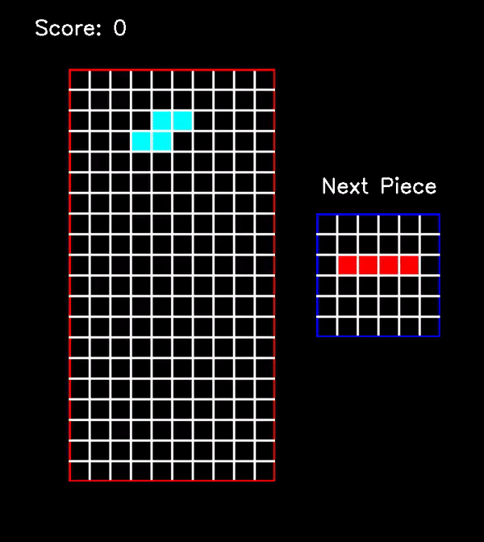

# Tetris AI
&emsp; &emsp; &emsp; &emsp; &emsp; &emsp; &emsp; &emsp; &emsp; &emsp; &emsp;


## Table of Contents
- [Tetris](#tetris)
- [Features](#features)
- [Controls](#controls)
- [Play Single PLayer](#play-single-player)
- [Train](#train-model)
- [Run Model](#run-model)
- [Dependencies](#dependencies)
- [License](#license)

## Tetris
An implementation of Tetris written using the Python programming language
with opencv as the graphics handler, NumPy to handle math operations, and
TensorFlow and Keras for the Deep Learning Model. Maximum score achieved
through deep learning model was 18136 during iteration 1911

## Features
* Tetris Single-player gameplay
* Deep learning model

## Controls
* W - Rotate piece 90 degrees clockwise
* A - Move piece one column to the right
* S - Move piece one row down
* D - Move piece one column to the left
* Space - Hard drop piece
* ESC - Quit game

## Play (Single-player)
* change directory to the 'src' folder of the project, 
then running the following command:

```sh
python3 play.py
```

## Train Model
* change directory to the 'src' folder of the project, 
then running the following command:

```sh
python3 train.py
```

## Run Model
* change directory to the 'src' folder of the project,
then running the following command:

```sh
python3 run_model.py
```



## Dependencies
```sh
tensorflow-gpu==1.14.0
tensorboard==1.14.0
keras==2.2.4
opencv==4.7.0.72
numpy==1.21.6
pillow==5.4.1
tqdm==4.31.1
```

* IMPORTANT: Running the saved model will only compile correctly
using Python 3.7

## License
Eliseo Copyright 2023
<br>
Code released under the [MIT License](LICENSE)
<br>
